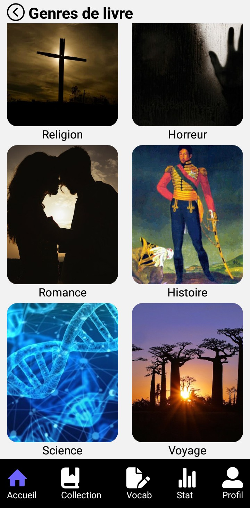
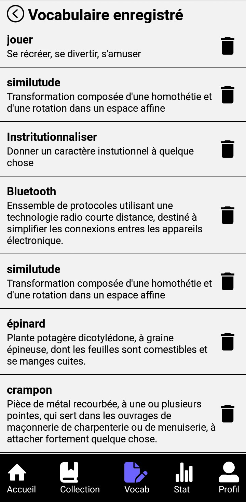
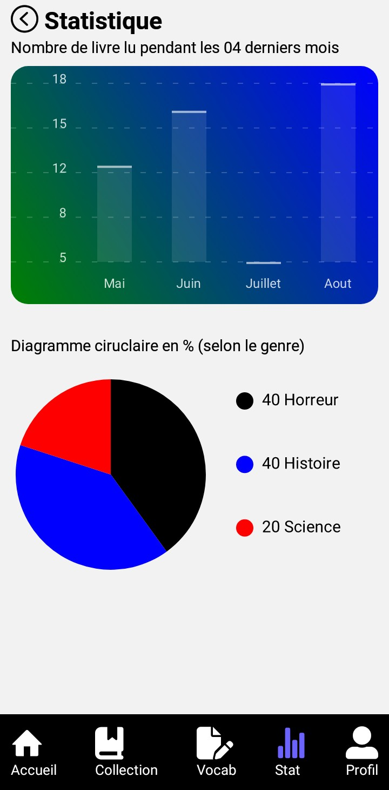

<h2>Screenshoot</h2>

<p float="left">
    
    
</p>

<p float="left">
    
    
</p>

<p float="left">
    
    
</p>

<p float="left">
    
    
</p>

<p float="left">
    
    
</p>
    

<h2>Dependences</h2>

- react-nativet-char-kit 

```raw
npm install react-native-chart-kit
```

- react-native-svg

```raw
npm install react-native svg
```

- @expo/vector-icons 

```raw
npm install @expo/vector-icons
```

- @react-navigation/native

```raw
npm install @react-navigation/native
```